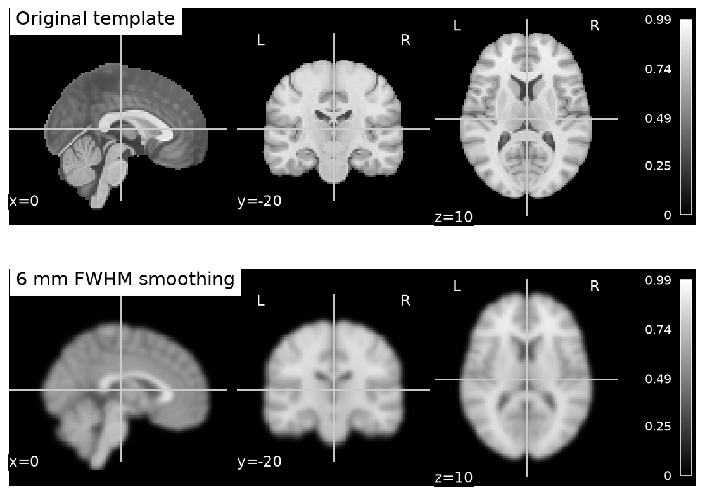

# From transparent toy examples to actual MRI

The four core notebooks run offline and generate their own data. They isolate concepts and provide known-answer checks. This page is the transition to real image files and an established analysis workflow; it is not a claim that the toy exercises constitute MRI preprocessing.

## First real image: an anatomical template

After 540.1–540.3, use Nilearn's packaged MNI152 template. It is an averaged anatomical reference, not a scan of the learner or one ordinary participant. Keep its provenance and do not treat atlas coordinates as subject-specific anatomy. The [template loader](https://nilearn.github.io/stable/modules/generated/nilearn.datasets.load_mni152_template.html) describes the resource and reference.

```python
from nilearn.datasets import load_mni152_template
from nilearn import image, plotting
import nibabel as nib
img = load_mni152_template(resolution=2)
print(img.shape, img.header.get_zooms(), nib.aff2axcodes(img.affine))
blurred = image.smooth_img(img, fwhm=6)
assert blurred.shape == img.shape
plotting.plot_anat(img, title="MNI152 template, original")
plotting.plot_anat(blurred, title="MNI152 template, 6 mm smoothing")
plotting.show()
```

Before running, predict whether smoothing changes the affine, grid, or image intensities. Check those separately. Use identical cuts and display limits for a fair comparison; ask the AI to add those parameters from current documentation. The goal is visual and metadata inspection, not interpreting intensity as biological activity. See [verification](verification/REPORT.md) for whether this bridge was executed in the delivered environment.

**Executed reference result:** shape `(99,117,95)`, 2 mm isotropic voxels, axis codes `RAS`. Smoothing preserved shape/affine and changed the stored intensities. The paired figure below uses the same cuts and intensity limits. Source: Nilearn's packaged MNI152 reference; an averaged template, not an individual scan.



## A real functional teaching dataset

Use the [UCL/SPM single-subject auditory dataset](https://www.fil.ion.ucl.ac.uk/spm/data/auditory/) with the official [Nilearn single-subject GLM tutorial](https://nilearn.github.io/stable/auto_examples/00_tutorials/plot_single_subject_single_run.html). These are external teaching materials. The scan archive is not redistributed in this pack; read its provenance and use conditions at the source before obtaining it.

This fetch call needs internet and downloads the teaching data into the specified directory:

```python
from nilearn.datasets import fetch_spm_auditory
data = fetch_spm_auditory(data_dir="../data/spm_auditory")
print(data.keys())
print(data.description)
```

The [fetcher documentation](https://nilearn.github.io/stable/modules/generated/nilearn.datasets.fetch_spm_auditory.html) describes the returned files. Do not invent field names or timing. Read the dataset description and tutorial, identify the actual returned images/events, and copy required acquisition values with their source.

**Class tasks:**

1. Produce an image card: shape, voxel sizes, orientation, affine, TR from documented metadata, and what preprocessing has already occurred.
2. Read the tutorial in five stages: load/inspect, design, fit, contrast, display/inference. For each, write the input/output and one check before asking AI for a snippet.
3. Inspect anatomical/functional correspondence and coverage; identify preprocessing assumptions. Do not perform registration simply because images have different shapes.
4. Plot the actual design matrix and explain the event-to-HRF transformation. Name contrast columns and direction.
5. Fit using the tutorial's supported first-level tools. Inspect their temporal-noise settings, filtering, scaling, masks, and multiple-comparison decisions. Record versions rather than assuming defaults are timeless.
6. Report the result as a within-subject teaching analysis. Repeated time points do not make a cohort. One subject cannot establish population generalization.

**Pass evidence:** actual file metadata, overlay screenshots, design/contrast definition, provenance of timing, output-map type, and an interpretation with stated limits. If acquisition or processing history is unclear, the learner identifies that gap rather than filling it with an AI guess.

## Later independent project

A mentor can select an appropriate [OpenNeuro](https://openneuro.org/) dataset with documented consent/use terms, BIDS metadata, sufficient independent participants, and a question matched to the data. Record its exact dataset identifier/version and license. Prefer existing validated derivatives when teaching analysis first. Running fMRIPrep/FreeSurfer/ANTs from raw MRI adds time, storage, software requirements, and QC responsibilities; a generated shell command is not evidence the processing succeeded.

Start CNN/foundation-model work only after a baseline and defensible participant/site evaluation are ready. The model's license, pretraining participants, modality, and input preparation all matter. Follow the 550.6 model-card audit; do not download restricted weights or treat the chat tutor as a substitute imaging model.
